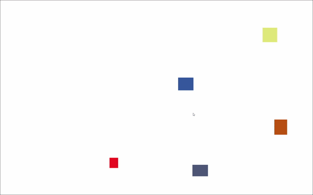

# Canvas Editor

A JavaScript library for building WYSIWYG editors and similar applications, based on [Konva](https://konvajs.org/).

The vision is to build a lighweight alternative to solutions like [Polotno SDK](https://polotno.com/) and [draw.io](https://app.diagrams.net/).

## Contributing

Pull requests are **very welcome!**
